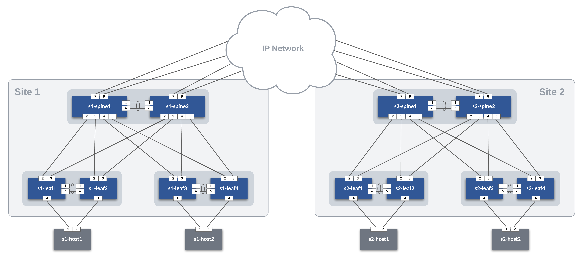

# Arista CI Workshops

## Dual Datacenter Topology

The ATD Dual Data Center Topology is used in this example.  The IP Network cloud is comprised of the border and core nodes in the topology.  The IP Network is pre-provisioned in this example.  Our focus will be building AVD data models for Site 1 and Site 2 and configuring each site to connect to an existing IP Network.



### Vlan and Host Addressing

#### Site Vlans and Subnets

| Site | Rack | Vlan |     Subnet    |
|:----:|:----:|:----:|:-------------:|
| 1    | 1    | 10   | 10.10.10.0/24 |
| 1    | 2    | 20   | 10.20.20.0/24 |
| 2    | 1    | 30   | 10.30.30.0/24 |
| 2    | 2    | 40   | 10.40.40.0/24 |

#### Host Addressing

| Site | Rack | Hostname | IP Address.     |
|:----:|:----:|:--------:|:---------------:|
| 1    | 1    | s1-host1 | 10.10.10.100/24 |
| 1    | 2    | s1-host2 | 10.20.20.100/24 |
| 2    | 1    | s2-host1 | 10.30.30.100/24 |
| 2    | 2    | s2-host2 | 10.40.40.100/24 |

**Note:** Host nodes are pre-configured with the addresses above.  AVD will configure the leaf ports for the hosts.

### WAN - IP Network

The WAN IP Network runs OSPF in Area 0.0.0.0 using /31's in the 10.0.0.0/24 address block.  The Spines in each DC will peer to nodes in the cloud.

## STEP #1 - Create ATD Lab

Create a new ATD Dual Center Lab and follow along. Ask your local account team for assistance.

## STEP #2 - Clone this repo to your ATD Lab

Using the Programmability IDE, clone this repo to your lab instance.

``` bash
cd /home/coder/project/labfiles
git clone https://github.com/PacketAnglers/workshops-avd.git
cd workshops-avd
```

## STEP #3 - Update AVD to Latest Version

Update AVD and requirements to the latest version

``` bash
ansible-galaxy collection install arista.avd arista.cvp --force
export ARISTA_AVD_DIR=$(ansible-galaxy collection list arista.avd --format yaml | head -1 | cut -d: -f1)
pip3 config set global.disable-pip-version-check true
pip3 install -r ${ARISTA_AVD_DIR}/arista/avd/requirements.txt
```

**Note:** This must be done each time you start your ATD Lab.

## STEP #4 - Set Lab Password environment variable

The following command sets the environment variable `LABPASSPHRASE` which is used later for connecting to your lab switches and creating local user password.

``` bash
export LABPASSPHRASE=`cat /home/coder/.config/code-server/config.yaml| grep "password:" | awk '{print $2}'`
```

**Note:** This must also be done each time you start your ATD Lab.

## STEP #5 - Initialize IP Network Cloud environment

This step pushes pre-defined configs for IP Network Cloud & Host Nodes

``` bash
make preplab
```

## STEP #6 - Build Site Configs

Once you have adjusted your data model per site, you can build the configs with the following commands.  We discuss the data models in the workshop.  You can review the data model in the [Workshop Guide](https://aristanetworks.github.io/avd-workshops/avd/).

``` bash
# Build Site 1 Configs
make build-site-1

# Build Site 2 Configs
make build-site-2
```

## STEP #7 - Deploy Site Configs

The following will push your configurations to the switches per site.

``` bash
# Build Site 1 Configs
make deploy-site-1

# Build Site 2 Configs
make deploy-site-2
```

## Test Traffic

Log on to a spine to verify OSPF neighbors and ip routes.

From `s1-spine1`

``` bash
show ip ospf neighbors
show ip route
ping 10.30.30.1
```

Log on to a host and ping to a remote host.

From `s1-host1` ping `s2-host2`.

``` bash
ping 10.40.40.100
```